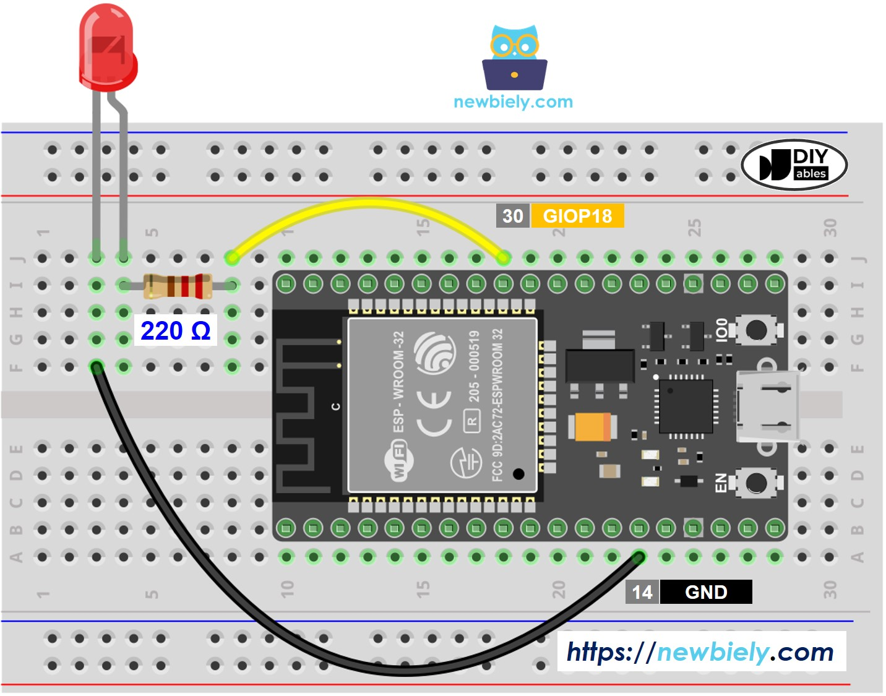
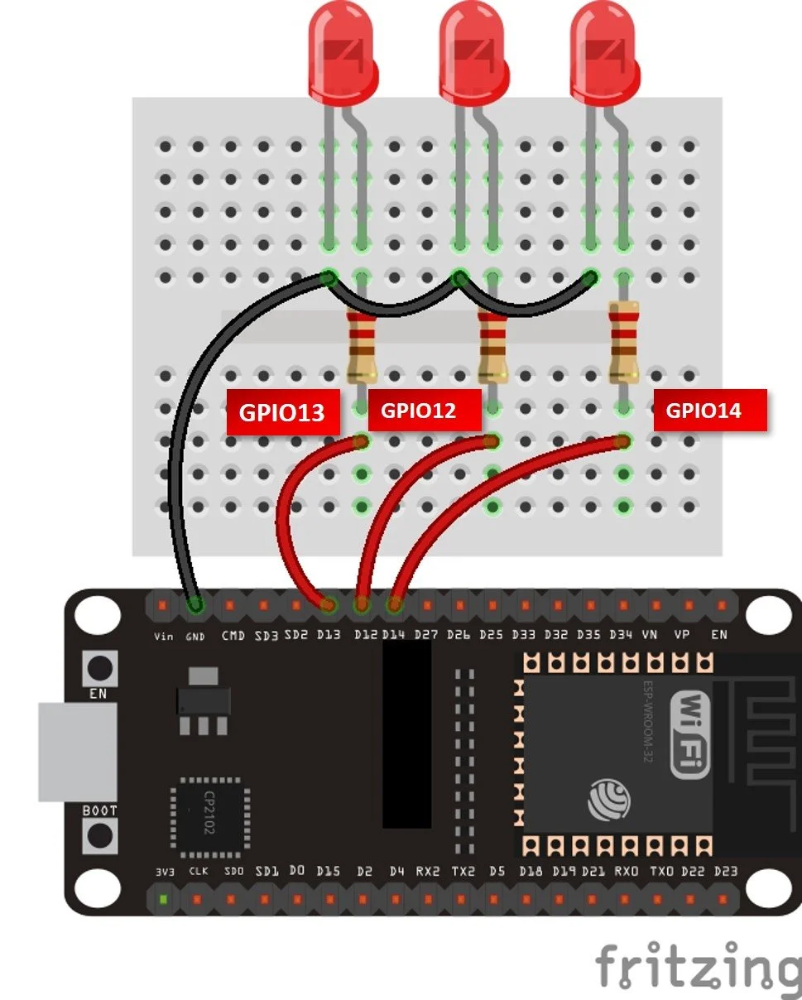

# Builtin Blink

Blinks the ESP32's built-in LED (GPIO 2) on and off every second using MicroPython.

## Description

This is a minimal MicroPython script that toggles the onboard LED of an ESP32 board in an infinite loop with a 1-second interval. It serves as the "Hello, World!" of embedded systems.

## Getting Started

### Prerequisites

- ESP32 board with MicroPython firmware installed
- [Thonny IDE](https://thonny.org/) or any tool that supports uploading files to MicroPython devices (e.g., `ampy`, `rshell`, `mpremote`)

### Flashing MicroPython (if not already installed)

1. Download the latest MicroPython firmware for ESP32 from [micropython.org](https://micropython.org/download/esp32/)
2. Flash it using `esptool`:
   ```bash
   esptool.py --chip esp32 --port /dev/ttyUSB0 erase_flash
   esptool.py --chip esp32 --port /dev/ttyUSB0 write_flash -z 0x1000 esp32-*.bin
   ```

### Running the Script

**Using Thonny:**
1. Open Thonny and connect your ESP32 via USB
2. Open `main.py`
3. Click **Run** or save it as `main.py` on the device — it will run automatically on boot

**Using mpremote:**
```bash
mpremote connect /dev/ttyUSB0 run main.py
```

**Using ampy:**
```bash
ampy --port /dev/ttyUSB0 run main.py
```

### Expected Behavior

The built-in LED (GPIO 2) blinks with a 1-second on / 1-second off cycle indefinitely.

## Connecting an External LED

You can connect an external LED to any available GPIO pin instead of (or in addition to) the built-in one.

### Components Needed

- 1x LED
- 1x 220–330 Ω resistor
- Jumper wires
- Breadboard

### Wiring

```
ESP32 GPIO pin  →  Resistor (220Ω)  →  LED anode (+, longer leg)
                                        LED cathode (-, shorter leg)  →  GND
```

Example using GPIO 4:

```
GPIO 4  ──[220Ω]──  LED+  →  LED-  ──  GND
```

### Updating the Code

Change the pin number in `main.py` to match the GPIO pin you wired the LED to:

```python
led = machine.Pin(4, machine.Pin.OUT)  # Replace 4 with your chosen GPIO pin
```

### Notes

- Always use a current-limiting resistor (220–330 Ω) in series with the LED to avoid damaging it or the ESP32.
- ESP32 GPIO pins output 3.3 V. A 220 Ω resistor limits current to ~15 mA, which is safe for most standard LEDs.
- Avoid using GPIO 6–11 as they are connected to the internal flash memory.


## Self Develop

You can extend this project by connecting multiple LEDs and creating patterns or a chaser effect.

### LED Chaser Example

Wire several LEDs to consecutive GPIO pins and cycle through them in sequence:

```python
import machine
import time

pins = [12, 13, 14]
leds = [machine.Pin(p, machine.Pin.OUT) for p in pins]

while True:
    for led in leds:
        led.on()
        time.sleep(0.2)
        led.off()
```

### Wiring Diagram



### LED Chaser in Action



---

## Reference

[Blink A Led With Esp32 And Micropython](https://www.electromaker.io/project/view/blink-a-led-with-esp32-and-micropython)

[ESP32 and ESP8266 GPIO Programming with MicroPython – LED Blinking Example](https://microcontrollerslab.com/esp32-esp8266-gpio-programming-micropython-led-blinking/)
