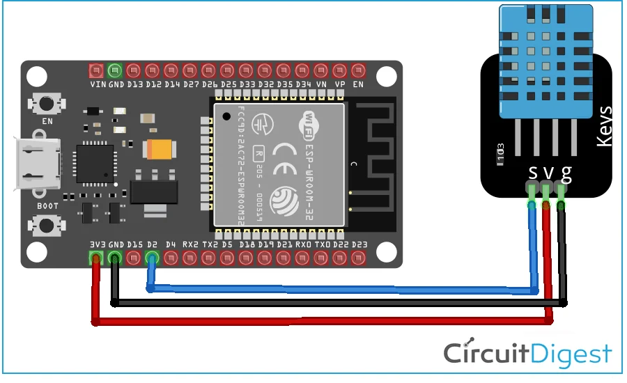
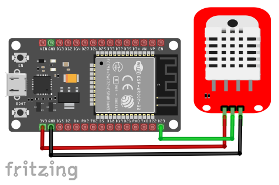
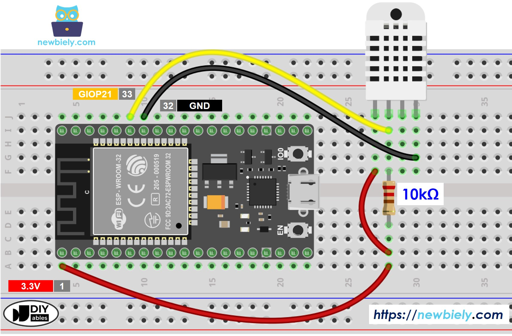

# Temperature and Humidity Web Server

Reads temperature and humidity from a DHT22 (or DHT11) sensor connected to an ESP32 and serves the values over a simple HTTP web page using MicroPython.

## Description

The project consists of two files:

- **`boot.py`** — runs on every boot. It imports the required libraries, connects the ESP32 to your Wi-Fi network as a station, and initialises the DHT22 sensor on GPIO 14.
- **`main.py`** — opens a TCP socket on port 80, waits for HTTP connections, reads the sensor, and responds with a styled HTML page showing the current temperature (°C) and humidity (%).

Once running, open a browser and navigate to the IP address printed in the serial console after boot to view the live sensor readings.

## Wiring

### DHT22 (or DHT11) to ESP32

```
DHT22 Pin  →  ESP32
---------     -----
VCC (1)    →  3.3V
DATA (2)   →  GPIO 14
GND (4)    →  GND
```

A 10 kΩ pull-up resistor between DATA and VCC is recommended for reliable communication.

```
3.3V ──[10kΩ]──┬── GPIO 14
               │
              DATA pin of sensor
```

> **DHT11 vs DHT22:** The DHT11 has lower accuracy (±2°C, ±5% RH) and a narrower range. The DHT22 is more precise (±0.5°C, ±2–5% RH) and supports a wider temperature range. To use a DHT11, comment out the DHT22 line and uncomment the DHT11 line in `boot.py`.

### Wiring Diagram







---

## Getting Started

### Prerequisites

- ESP32 board with MicroPython firmware installed
- DHT22 or DHT11 sensor
- Access to your Wi-Fi network credentials
- [Thonny IDE](https://thonny.org/) or a tool such as `mpremote` or `ampy`

### Flashing MicroPython (if not already installed)

1. Download the latest MicroPython firmware for ESP32 from [micropython.org](https://micropython.org/download/esp32/)
2. Flash it using `esptool`:
   ```bash
   esptool.py --chip esp32 --port /dev/ttyUSB0 erase_flash
   esptool.py --chip esp32 --port /dev/ttyUSB0 write_flash -z 0x1000 esp32-*.bin
   ```

### Configuration

Before uploading, open `boot.py` and set your Wi-Fi credentials:

```python
ssid = 'REPLACE_WITH_YOUR_SSID'
password = 'REPLACE_WITH_YOUR_PASSWORD'
```

### Uploading the Files

Both `boot.py` and `main.py` must be uploaded to the device root.

**Using Thonny:**
1. Connect your ESP32 via USB and open Thonny
2. Upload `boot.py` and `main.py` to the device (File → Save as → MicroPython device)
3. Reset the board — it will connect to Wi-Fi on boot and start the web server

**Using mpremote:**
```bash
mpremote connect /dev/ttyUSB0 fs cp boot.py :boot.py
mpremote connect /dev/ttyUSB0 fs cp main.py :main.py
```

**Using ampy:**
```bash
ampy --port /dev/ttyUSB0 put boot.py
ampy --port /dev/ttyUSB0 put main.py
```

### Expected Behavior

After reset, the serial console prints:

```
Connection successful
('192.168.x.x', '255.255.255.0', '192.168.x.1', '192.168.x.1')
```

Open a browser and go to `http://192.168.x.x` (the IP shown above). The page displays the current temperature in °C and relative humidity in %. Each page refresh triggers a new sensor read.

If the sensor fails to respond, the web page will show `0` for both values and the serial console will print:

```
Failed to read sensor.
```

## References

[016 - ESP32 MicroPython: Web Server | ESP32 Access Point](https://techtotinker.com/016-esp32-micropython-web-server-esp32-access-point-mode-in-micropython/)
